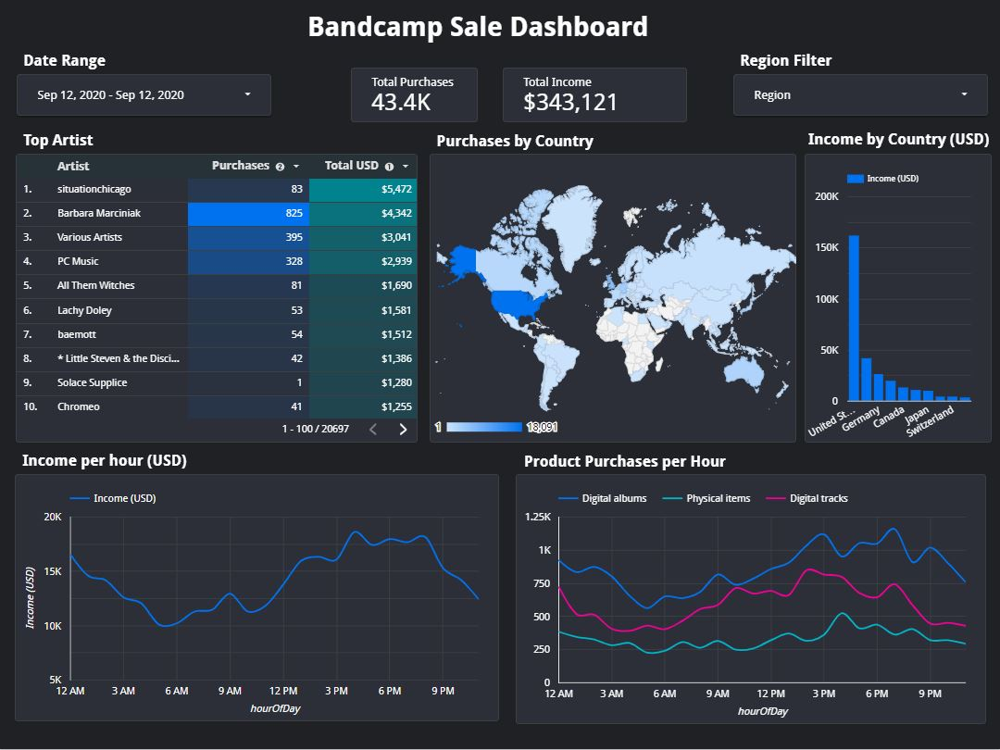

# Bandcamp-DE-project

A ELT Data Engineer project with various of tools: Airflow, Terraform, Docker, Spark, GCP and more

## Table of contents

- [Description](#description)
    - [Overview](#overview)
    - [Architect](#architect)
    - [Dasboard](#dashboard)
    - [Goal](#goal)
    - [Dataset](#dataset)
    - [Tool&Techs](#tools--techs)
    - [Scalability](#scalability)
    - [Insight from the dataset](#insight-from-the-dataset)
- [Reproduce this project](#reproduce-this-project)
- [Acknowledgement](#acknowledgement)

## Description

### Status

*Not Done yet*
What is more to complete?
- Move dbt to airflow for completely automate work!
- Complete the airflow docker and put everything under one docker-compose env
- Create bash script for reproducibility in VM
- Create Guildline 
- Complete docs

### Overview

This project is ingest data from [Bandcamp sale data](https://components.one/datasets/bandcamp-sales) and create an end-to-end data pipeline. The data would be transformed into daily parquet file and stored in datalake. Next, the daily batch jobs will consume these data, load to datawarehouse, applies transformations, and displays to the dashboard.

### Architect

will be added soon..

### Dashboard

You can access [Dashboard](https://datastudio.google.com/reporting/d145a14a-b4da-4c9b-973b-723fbea5bffb) here.

### Goal

My mainly goal is to learn more about data engineer work flow/tools. But that not how we describe the problem right? So, the final goal of this project is to create data pipeline based on GCP and analyze the data by create dashboard to describe the following business question below:

- Which Artist has highest purchase and how much is it?

- Which hour of the day has highest and lowest purchases?

- Which type of product has highest purchases and at what time of the day?

- Ranking of Region/Country purchases and amount of it in USD

### Dataset

The main dataset is [Bandcamp sale data](https://components.one/datasets/bandcamp-sales) which contain 1,000,000 items from Bandcamp's sales feed between 9/9/2020 and 10/2/2020 and is a slice of the whole dataset of 6.7 million sales. Other dataset: [Country regional code](https://github.com/lukes/ISO-3166-Countries-with-Regional-Codes) and [Currency](https://github.com/datasets/currency-codes/blob/master/data/codes-all.csv) is used for cleansing and transformation.

### Tools & Techs

*maybe add more describtion/link idk*

- Cloud - Google Cloud Platform
- Infrastructure as Code software - Terraform
- Containerization - Docker, Docker Compose
- Orchestration - Airflow
- Transformation - dbt, Spark
- Cluster management - Dataproc
- Data Lake - Google Cloud Storage
- Data Warehouse - BigQuery
- Data Visualization - Data Studio
- Language - Python, Bash

### Scalability

If the data is increased in a siginificant number let's say 1000x then, scale up dataproc cluster in horizontally (add more worker/node) or both vertically and horizontally (add more worker and improve performance) is a good idea too.

### Insight from the dataset

#### Most purchases country by region
- American: United States, 397666
- Europe: United Kingdom, 148551
- Oceania: Australia, 55637
- Asia: Japan, 32496
- Africa: South Africa, 2155

#### What time has the highest Purchases in a day
- 1 PM : 59903 

#### What time has the lowest Purchases in a day
- 5 AM : 24007

## Reproduce this project

will be added soon..

### Prerequisites

The following requirements are needed to reproduce the project:

### Terraform

### Airflow

### dbt

## Acknowledgement

This project cannot be completed without this amazing [course](https://github.com/DataTalksClub/data-engineering-zoomcamp) from [DataTalks.Club](https://datatalks.club/).

## ref

- [Data-engineering-zoomcamp](https://github.com/DataTalksClub/data-engineering-zoomcamp)